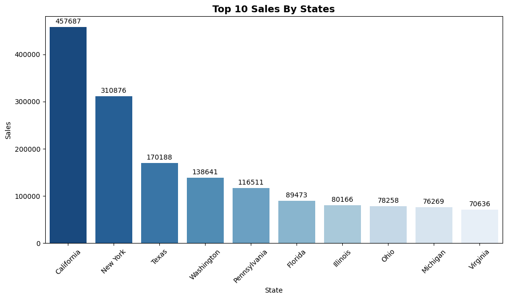
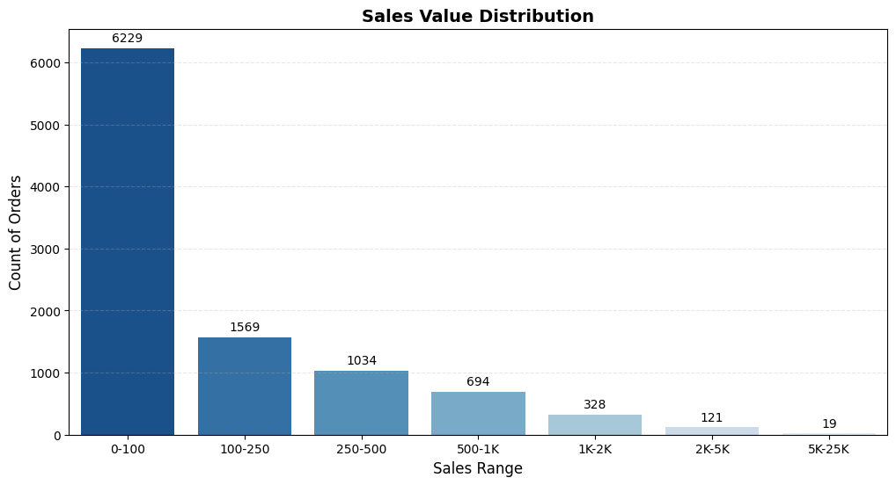
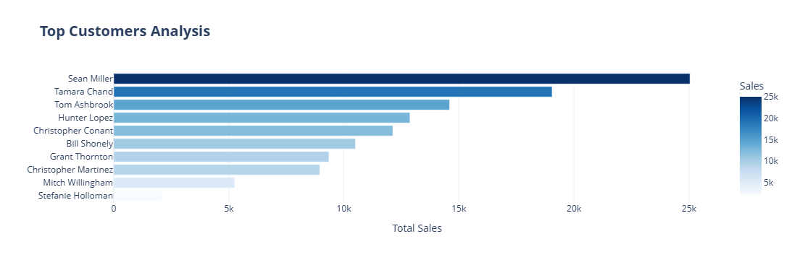
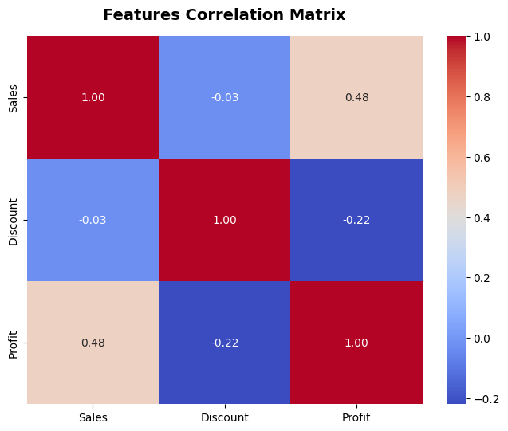
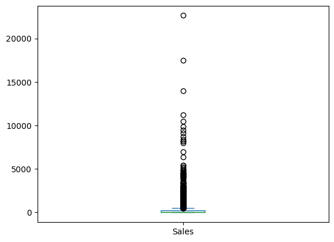
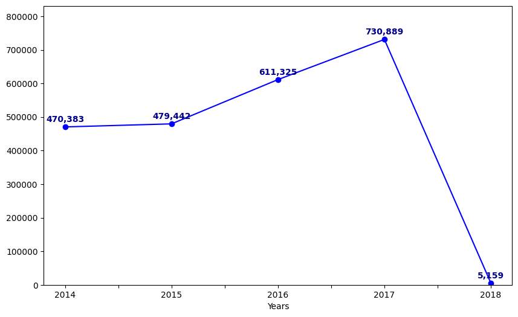

# Reporting with SQL — Superstore Sales Analysis

A SQL-in-Jupyter analytics project that explores the classic "Superstore" retail dataset. SQL queries are written and executed directly inside a Jupyter Notebook (via `ipython-sql` / `%%sql` magic against a SQL Server database), and the result sets are pulled into `pandas` for visualization with `matplotlib`, `seaborn`, and `plotly`.

## Repository Contents

| File | Description |
|---|---|
| `Reporting_with_SQL_GitHub.ipynb` | The main Jupyter Notebook containing all SQL queries, data processing, and visualizations. |
| `super store.xlsx` | The raw Superstore dataset (~9,994 order-line records) used to populate the SQL Server table. |
| `Superstore_Analytics.pdf` | An exported version of the notebook's analysis and charts. |

## Dataset

The dataset is the well-known Superstore retail orders dataset, with 22 columns including `Order ID`, `Order Date`, `Ship Date`, `Customer Name`, `Segment`, `Region`, `Category`, `Sub-Category`, `Sales`, `Quantity`, `Discount`, `Profit`, and `Sales Agent`.

## What the Notebook Covers

The notebook connects to a SQL Server database (the local connection details have been removed for GitHub; the original query outputs and charts are preserved) and runs SQL queries for the following analyses:

- **Top 10 sales by state** — aggregated with `GROUP BY` / `ORDER BY`, visualized as a bar chart.
- **Sales distribution** — order values bucketed into custom ranges and plotted as a histogram/count chart.
- **Top customers** — ranked by average sale value and order count, visualized as a horizontal bar chart with Plotly.
- **Correlation analysis** — relationship between Sales, Discount, and Profit, shown as a heatmap.
- **Customer segmentation** — customers classified into VIP / Normal / Bad segments using `CASE WHEN` logic based on their sales and profit versus the overall average, including a check for outliers via a box plot.
- **Bad customer discovery** — customers with negative total profit, and the percentage of the customer base they represent.
- **Refined segmentation view** — a SQL `VIEW` (`r_c_l`) created to cleanly separate VIP vs. Normal customers among profitable accounts, with a count of customers per segment.
- **Sales over time** — yearly sales trend using `YEAR(Ship_Date)`, plotted as a line chart.

## Results & Visualizations

*(Charts below are the actual outputs extracted from the notebook's saved execution results, and the tables show the real query results.)*

### Top 10 States by Sales

| State | Sales |
|---|---|
| California | $457,687.6 |
| New York | $310,876.3 |
| Texas | $170,188.0 |
| Washington | $138,641.3 |
| Pennsylvania | $116,511.9 |
| Florida | $89,473.7 |
| Illinois | $80,166.1 |
| Ohio | $78,258.1 |
| Michigan | $76,269.6 |
| Virginia | $70,636.7 |



### Sales Distribution

Order-line sales values bucketed into custom ranges (0–100, 100–250, 250–500, 500–1K, 1K–2K, 2K–5K, 5K–25K) show most transactions cluster at the lower end, with a long tail of high-value orders.



### Top Customers (by Average Sale Value)

| Customer | Total Sales | Avg Sale | Orders |
|---|---|---|---|
| Mitch Willingham | $5,253.9 | $1,751.3 | 3 |
| Sean Miller | $25,043.1 | $1,669.5 | 15 |
| Tamara Chand | $19,052.2 | $1,587.7 | 12 |
| Grant Thornton | $9,351.2 | $1,558.5 | 6 |
| Tom Ashbrook | $14,595.6 | $1,459.6 | 10 |
| Hunter Lopez | $12,873.3 | $1,170.3 | 11 |
| Bill Shonely | $10,501.7 | $1,166.9 | 9 |
| Christopher Conant | $12,129.1 | $1,102.6 | 11 |



### Correlation: Sales, Discount, Profit

| Pair | Correlation |
|---|---|
| Sales ↔ Profit | +0.48 (moderate positive) |
| Sales ↔ Discount | −0.03 (negligible) |
| Discount ↔ Profit | −0.22 (weak negative) |

Higher discounts are mildly associated with lower profit, while sales volume and profit move together moderately.



### Sales Outliers

A box plot of individual order sales values confirms the presence of high-value outliers well above the typical order size.



### Customer Segmentation

Using SQL `CASE WHEN` logic (sales/profit vs. the dataset average):

- **793** total customers
- **155** customers (**20%**) have net-negative profit ("bad customers")
- After filtering to only profitable customers into the `r_c_l` view (**638** customers):

| Segment | Count |
|---|---|
| Vip Customer | 616 |
| Normal Customer | 22 |

### Sales Over Time

| Year | Sales |
|---|---|
| 2014 | $470,383 |
| 2015 | $479,443 |
| 2016 | $611,326 |
| 2017 | $730,890 |
| 2018 | $5,160 *(partial year in source data)* |

Sales grew steadily from 2014–2017, with 2018 showing only a small fraction of a full year's data (likely an incomplete/truncated final period in the source dataset).



## Tools & Libraries

- **SQL Server** (queried via `pyodbc` / `sqlalchemy` and the `ipython-sql` Jupyter extension)
- **pandas** / **numpy** for data handling
- **matplotlib** / **seaborn** / **plotly.express** for visualization
- **Jupyter Notebook**

## How to Run

1. Clone this repository.
2. Load `super store.xlsx` into a SQL Server database as a table named `superstore` (or adjust the table name in the queries).
3. Update the database connection cell in the notebook with your own connection string (the original credentials were stripped for GitHub).
4. Install the required Python packages:
   ```bash
   pip install pandas numpy matplotlib seaborn plotly pyodbc sqlalchemy ipython-sql
   ```
5. Open `Reporting_with_SQL_GitHub.ipynb` in Jupyter and run the cells in order.

## Output

`Superstore_Analytics.pdf` contains a static export of the notebook's charts and findings for quick viewing without running any code.

---

*Note: I generated this README by reading the actual notebook cells, sheet structure, and file contents in this repository rather than assuming its contents — let me know if any section needs correcting or expanding (e.g., adding sample chart screenshots or specific business takeaways from the segmentation).*
